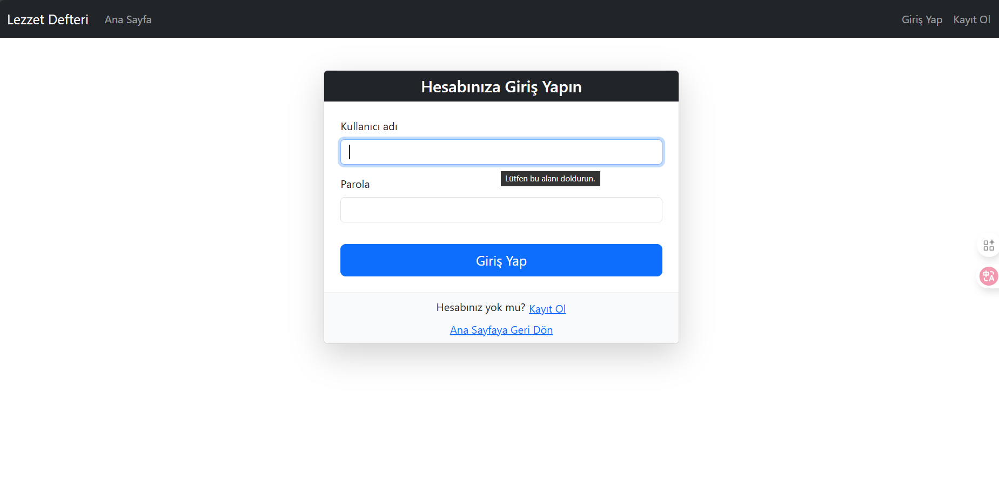
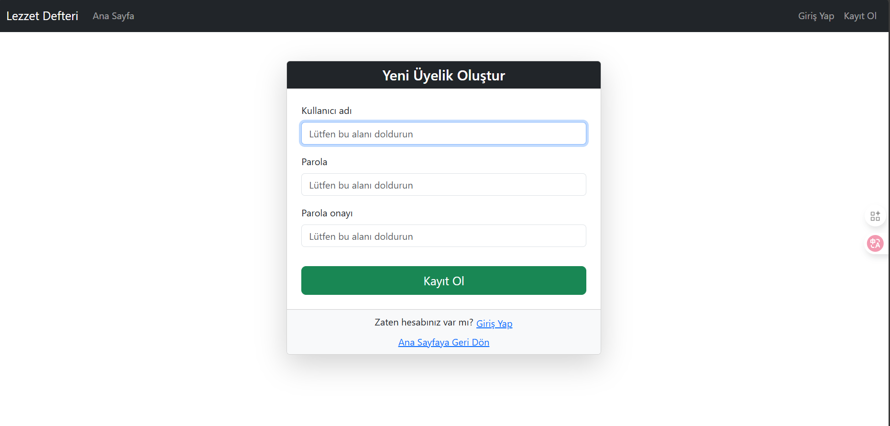
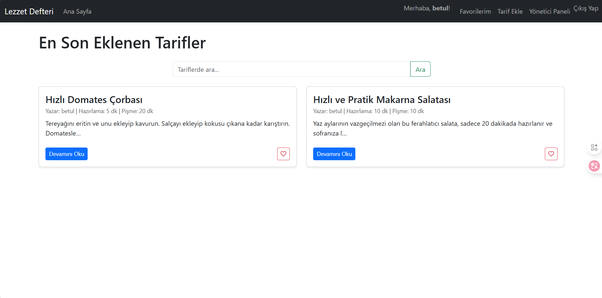
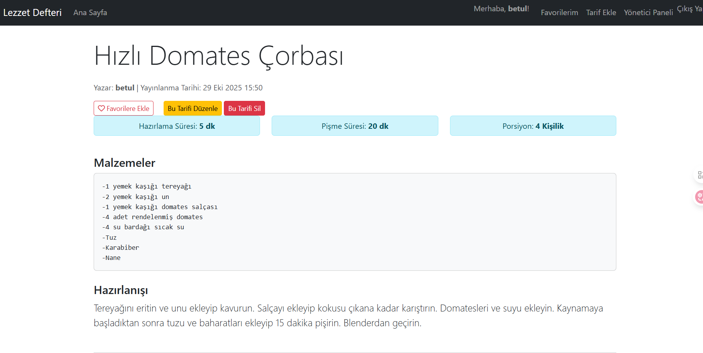

# lezzetdefteri-webuygulamasi
# Proje-4
# PYTHON

-----------------------------------------------

# Proje Açıklaması
--------------------

Bu proje, kullanıcıların en sevdikleri yemek tariflerini saklamaları, yeni tarifler keşfetmeleri, kendi tariflerini sisteme eklemeleri ve favorilerini yönetmeleri için geliştirilmiş bir Django tabanlı web uygulamasıdır. Uygulama, tariflerin kolayca listelenmesini ve aranmasını sağlayan modern bir arayüze sahiptir.

# Giriş/Kayıt Ekranı
----------------

Burada kullanıcı adı ve şifrenizi girerek sisteme giriş yapabilirsiniz ya da kayıtlı değilseniz kullanıcı adı ve şifre yazarak kayıt olabilirsiniz.

# Anasayfa
--------------

Tüm tariflerin listelendiği ve arama çubuğunun bulunduğu merkezi sayfa. Kullanıcılar buradan favorilerine ekleme/kaldırma işlemi yapabilirler.

# Tarif Detay Sayfası
--------------

Seçilen tarifin tüm malzemelerinin, hazırlık talimatlarının ve sürelerinin gösterildiği sayfa.

